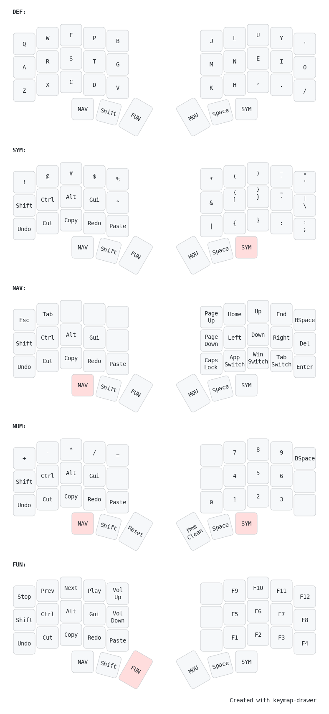

# Sellum - A custom approach to Callum + Seniply for 36 Keys 

This is my own keyboard layout, based on the Callum layout. I made some changes to improve functionality by adding ideas
from the Seniply layout. One of the main things I wanted was to have different layers for numbers and function keys.
This makes it easier to use both without them interfering with each other.

## Credits

- [Callum](https://github.com/qmk/qmk_firmware/tree/user-keymaps-still-present/users/callum)
- [Seniply](https://stevep99.github.io/seniply/)

Feel free to customize it however you like! I hope this layout helps make typing and navigation smoother for you.

